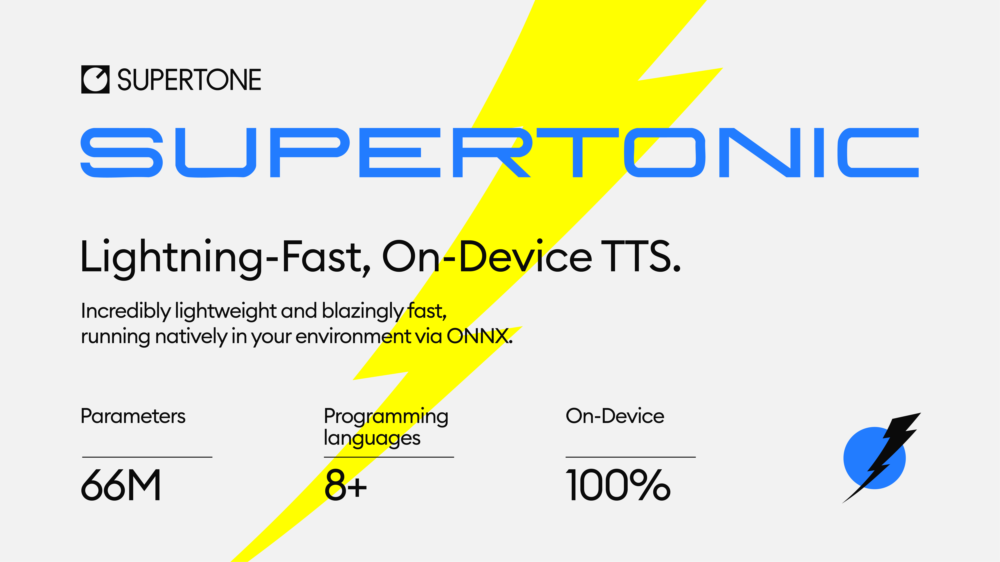

# Supertonic — Lightning Fast, On-Device TTS

[](https://huggingface.co/spaces/Supertone/supertonic#interactive-demo)
[](https://huggingface.co/Supertone/supertonic)

<p align="center">
  
</p>

**Supertonic** is a lightning-fast, on-device text-to-speech system designed for **extreme performance** with minimal computational overhead. Powered by ONNX Runtime, it runs entirely on your device—no cloud, no API calls, no privacy concerns.

> 🎧 **Try it now**: Experience Supertonic in your browser with our [**Interactive Demo**](https://huggingface.co/spaces/Supertone/supertonic#interactive-demo), or get started with pre-trained models from [**Hugging Face Hub**](https://huggingface.co/Supertone/supertonic)

### Table of Contents

- [Why Supertonic?](#why-supertonic)
- [Language Support](#language-support)
- [Getting Started](#getting-started)
- [Performance](#performance)
- [Citation](#citation)
- [License](#license)

## Why Supertonic?

- **⚡ Blazingly Fast**: Generates speech up to **167× faster than real-time** on consumer hardware (M4 Pro)—unmatched by any other TTS system
- **🪶 Ultra Lightweight**: Only **66M parameters**, optimized for efficient on-device performance with minimal footprint
- **📱 On-Device Capable**: **Complete privacy** and **zero latency**—all processing happens locally on your device
- **🎨 Natural Text Handling**: Seamlessly processes numbers, dates, currency, abbreviations, and complex expressions without pre-processing
- **⚙️ Highly Configurable**: Adjust inference steps, batch processing, and other parameters to match your specific needs
- **🧩 Flexible Deployment**: Deploy seamlessly across servers, browsers, and edge devices with multiple runtime backends.


## Language Support

We provide ready-to-use TTS inference examples across multiple ecosystems:

| Language/Platform | Path | Description |
|-------------------|------|-------------|
| [**Python**](py/) | `py/` | ONNX Runtime inference |
| [**Node.js**](nodejs/) | `nodejs/` | Server-side JavaScript |
| [**Browser**](web/) | `web/` | WebGPU/WASM inference |
| [**Java**](java/) | `java/` | Cross-platform JVM |
| [**C++**](cpp/) | `cpp/` | High-performance C++ |
| [**C#**](csharp/) | `csharp/` | .NET ecosystem |
| [**Go**](go/) | `go/` | Go implementation |
| [**Swift**](swift/) | `swift/` | macOS applications |
| [**iOS**](ios/) | `ios/` | Native iOS apps |
| [**Rust**](rust/) | `rust/` | Memory-safe systems |

> For detailed usage instructions, please refer to the README.md in each language directory.

## Getting Started

First, clone the repository:

```bash
git clone https://github.com/supertone-inc/supertonic.git
cd supertonic
```

### Prerequisites

Before running the examples, download the ONNX models and preset voices, and place them in the `assets` directory:

> **Note:** The Hugging Face repository uses Git LFS. Please ensure Git LFS is installed and initialized before cloning or pulling large model files.
> - macOS: `brew install git-lfs && git lfs install`
> - Generic: see `https://git-lfs.com` for installers

```bash
git clone https://huggingface.co/Supertone/supertonic assets
```

### Quick Start

**Python Example** ([Details](py/))
```bash
cd py
uv sync
uv run example_onnx.py
```

**Node.js Example** ([Details](nodejs/))
```bash
cd nodejs
npm install
npm start
```

**Browser Example** ([Details](web/))
```bash
cd web
npm install
npm run dev
```

**Java Example** ([Details](java/))
```bash
cd java
mvn clean install
mvn exec:java
```

**C++ Example** ([Details](cpp/))
```bash
cd cpp
mkdir build && cd build
cmake .. && cmake --build . --config Release
./example_onnx
```

**C# Example** ([Details](csharp/))
```bash
cd csharp
dotnet restore
dotnet run
```

**Go Example** ([Details](go/))
```bash
cd go
go mod download
go run example_onnx.go helper.go
```

**Swift Example** ([Details](swift/))
```bash
cd swift
swift build -c release
.build/release/example_onnx
```

**Rust Example** ([Details](rust/))
```bash
cd rust
cargo build --release
./target/release/example_onnx
```

**iOS Example** ([Details](ios/))
```bash
cd ios/ExampleiOSApp
xcodegen generate
open ExampleiOSApp.xcodeproj
```
- In Xcode: Targets → ExampleiOSApp → Signing: select your Team
- Choose your iPhone as run destination → Build & Run


### Technical Details

- **Runtime**: ONNX Runtime for cross-platform inference (CPU-optimized; GPU mode is not tested)
- **Browser Support**: onnxruntime-web for client-side inference
- **Batch Processing**: Supports batch inference for improved throughput
- **Audio Output**: Outputs 16-bit WAV files

## Performance

We evaluated Supertonic's performance (with 2 inference steps) using two key metrics across input texts of varying lengths: Short (59 chars), Mid (152 chars), and Long (266 chars).

**Metrics:**
- **Characters per Second**: Measures throughput by dividing the number of input characters by the time required to generate audio. Higher is better.
- **Real-time Factor (RTF)**: Measures the time taken to synthesize audio relative to its duration. Lower is better (e.g., RTF of 0.1 means it takes 0.1 seconds to generate one second of audio).

### Characters per Second
| System | Short (59 chars) | Mid (152 chars) | Long (266 chars) |
|--------|-----------------|----------------|-----------------|
| **Supertonic** (M4 pro - CPU) | 912 | 1048 | 1263 |
| **Supertonic** (M4 pro - WebGPU) | 996 | 1801 | 2509 |
| **Supertonic** (RTX4090) | 2615 | 6548 | 12164 |
| `API` [ElevenLabs Flash v2.5](https://elevenlabs.io/docs/api-reference/text-to-speech/convert) | 144 | 209 | 287 |
| `API` [OpenAI TTS-1](https://platform.openai.com/docs/guides/text-to-speech) | 37 | 55 | 82 |
| `API` [Gemini 2.5 Flash TTS](https://ai.google.dev/gemini-api/docs/speech-generation) | 12 | 18 | 24 |
| `API` [Supertone Sona speech 1](https://docs.supertoneapi.com/en/api-reference/endpoints/text-to-speech) | 38 | 64 | 92 |
| `Open` [Kokoro](https://github.com/hexgrad/kokoro/) | 104 | 107 | 117 |
| `Open` [NeuTTS Air](https://github.com/neuphonic/neutts-air) | 37 | 42 | 47 |

> **Notes:**  
> `API` = Cloud-based API services (measured from Seoul)  
> `Open` = Open-source models  
> Supertonic (M4 pro - CPU) and (M4 pro - WebGPU): Tested with ONNX  
> Supertonic (RTX4090): Tested with PyTorch model  
> Kokoro: Tested on M4 Pro CPU with ONNX  
> NeuTTS Air: Tested on M4 Pro CPU with Q8-GGUF

### Real-time Factor

| System | Short (59 chars) | Mid (152 chars) | Long (266 chars) |
|--------|-----------------|----------------|-----------------|
| **Supertonic** (M4 pro - CPU) | 0.015 | 0.013 | 0.012 |
| **Supertonic** (M4 pro - WebGPU) | 0.014 | 0.007 | 0.006 |
| **Supertonic** (RTX4090) | 0.005 | 0.002 | 0.001 |
| `API` [ElevenLabs Flash v2.5](https://elevenlabs.io/docs/api-reference/text-to-speech/convert) | 0.133 | 0.077 | 0.057 |
| `API` [OpenAI TTS-1](https://platform.openai.com/docs/guides/text-to-speech) | 0.471 | 0.302 | 0.201 |
| `API` [Gemini 2.5 Flash TTS](https://ai.google.dev/gemini-api/docs/speech-generation) | 1.060 | 0.673 | 0.541 |
| `API` [Supertone Sona speech 1](https://docs.supertoneapi.com/en/api-reference/endpoints/text-to-speech) | 0.372 | 0.206 | 0.163 |
| `Open` [Kokoro](https://github.com/hexgrad/kokoro/) | 0.144 | 0.124 | 0.126 |
| `Open` [NeuTTS Air](https://github.com/neuphonic/neutts-air) | 0.390 | 0.338 | 0.343 |

<details>
<summary><b>Additional Performance Data (5-step inference)</b></summary>

<br>

**Characters per Second (5-step)**

| System | Short (59 chars) | Mid (152 chars) | Long (266 chars) |
|--------|-----------------|----------------|-----------------|
| **Supertonic** (M4 pro - CPU) | 596 | 691 | 850 |
| **Supertonic** (M4 pro - WebGPU) | 570 | 1118 | 1546 |
| **Supertonic** (RTX4090) | 1286 | 3757 | 6242 |

**Real-time Factor (5-step)**

| System | Short (59 chars) | Mid (152 chars) | Long (266 chars) |
|--------|-----------------|----------------|-----------------|
| **Supertonic** (M4 pro - CPU) | 0.023 | 0.019 | 0.018 |
| **Supertonic** (M4 pro - WebGPU) | 0.024 | 0.012 | 0.010 |
| **Supertonic** (RTX4090) | 0.011 | 0.004 | 0.002 |

</details>

### Natural Text Handling

Supertonic is designed to handle complex, real-world text inputs that contain numbers, currency symbols, abbreviations, dates, and proper nouns.

> 🎧 **View audio samples more easily**: Check out our [**Interactive Demo**](https://huggingface.co/spaces/Supertone/supertonic#text-handling) for a better viewing experience of all audio examples

**Overview of Test Cases:**

| Category | Key Challenges | Supertonic | ElevenLabs | OpenAI | Gemini |
|:--------:|:--------------:|:----------:|:----------:|:------:|:------:|
| Financial Expression | Decimal currency, abbreviated magnitudes (M, K), currency symbols, currency codes | ✅ | ❌ | ❌ | ❌ |
| Time and Date | Time notation, abbreviated weekdays/months, date formats | ✅ | ❌ | ❌ | ❌ |
| Phone Number | Area codes, hyphens, extensions (ext.) | ✅ | ❌ | ❌ | ❌ |
| Technical Unit | Decimal numbers with units, abbreviated technical notations | ✅ | ❌ | ❌ | ❌ |

<details>
<summary><b>Example 1: Financial Expression</b></summary>

<br>

**Text:**
> "The startup secured **$5.2M** in venture capital, a huge leap from their initial **$450K** seed round."

**Challenges:**
- Decimal point in currency ($5.2M should be read as "five point two million")
- Abbreviated magnitude units (M for million, K for thousand)
- Currency symbol ($) that needs to be properly pronounced as "dollars"

**Audio Samples:**

| System | Result | Audio Sample |
|--------|--------|--------------|
| **Supertonic** | ✅ | [🎧 Play Audio](https://drive.google.com/file/d/1eancUOhiSXCVoTu9ddh4S-OcVQaWrPV-/view?usp=sharing) |
| ElevenLabs Flash v2.5 | ❌ | [🎧 Play Audio](https://drive.google.com/file/d/1-r2scv7XQ1crIDu6QOh3eqVl445W6ap_/view?usp=sharing) |
| OpenAI TTS-1 | ❌ | [🎧 Play Audio](https://drive.google.com/file/d/1MFDXMjfmsAVOqwPx7iveS0KUJtZvcwxB/view?usp=sharing) |
| Gemini 2.5 Flash TTS | ❌ | [🎧 Play Audio](https://drive.google.com/file/d/1dEHpNzfMUucFTJPQK0k4RcFZvPwQTt09/view?usp=sharing) |

</details>

<details>
<summary><b>Example 2: Time and Date</b></summary>

<br>

**Text:**
> "The train delay was announced at **4:45 PM** on **Wed, Apr 3, 2024** due to track maintenance."

**Challenges:**
- Time expression with PM notation (4:45 PM)
- Abbreviated weekday (Wed)
- Abbreviated month (Apr)
- Full date format (Apr 3, 2024)

**Audio Samples:**

| System | Result | Audio Sample |
|--------|--------|--------------|
| **Supertonic** | ✅ | [🎧 Play Audio](https://drive.google.com/file/d/1ehkZU8eiizBenG2DgR5tzBGQBvHS0Uaj/view?usp=sharing) |
| ElevenLabs Flash v2.5 | ❌ | [🎧 Play Audio](https://drive.google.com/file/d/1ta3r6jFyebmA-sT44l8EaEQcMLVmuOEr/view?usp=sharing) |
| OpenAI TTS-1 | ❌ | [🎧 Play Audio](https://drive.google.com/file/d/1sskmem9AzHAQ3Hv8DRSZoqX_pye-CXuU/view?usp=sharing) |
| Gemini 2.5 Flash TTS | ❌ | [🎧 Play Audio](https://drive.google.com/file/d/1zx9X8oMsLMXW0Zx_SURoqjju-By2yh_n/view?usp=sharing) |

</details>

<details>
<summary><b>Example 3: Phone Number</b></summary>

<br>

**Text:**
> "You can reach the hotel front desk at **(212) 555-0142 ext. 402** anytime."

**Challenges:**
- Area code in parentheses that should be read as separate digits
- Phone number with hyphen separator (555-0142)
- Abbreviated extension notation (ext.)
- Extension number (402)

**Audio Samples:**

| System | Result | Audio Sample |
|--------|--------|--------------|
| **Supertonic** | ✅ | [🎧 Play Audio](https://drive.google.com/file/d/1z-e5iTsihryMR8ll1-N1YXkB2CIJYJ6F/view?usp=sharing) |
| ElevenLabs Flash v2.5 | ❌ | [🎧 Play Audio](https://drive.google.com/file/d/1HAzVXFTZfZm0VEK2laSpsMTxzufcuaxA/view?usp=sharing) |
| OpenAI TTS-1 | ❌ | [🎧 Play Audio](https://drive.google.com/file/d/15tjfAmb3GbjP_kmvD7zSdIWkhtAaCPOg/view?usp=sharing) |
| Gemini 2.5 Flash TTS | ❌ | [🎧 Play Audio](https://drive.google.com/file/d/1BCL8n7yligUZyso970ud7Gf5NWb1OhKD/view?usp=sharing) |

</details>

<details>
<summary><b>Example 4: Technical Unit</b></summary>

<br>

**Text:**
> "Our drone battery lasts **2.3h** when flying at **30kph** with full camera payload."

**Challenges:**
- Decimal time duration with abbreviation (2.3h = two point three hours)
- Speed unit with abbreviation (30kph = thirty kilometers per hour)
- Technical abbreviations (h for hours, kph for kilometers per hour)
- Technical/engineering context requiring proper pronunciation

**Audio Samples:**

| System | Result | Audio Sample |
|--------|--------|--------------|
| **Supertonic** | ✅ | [🎧 Play Audio](https://drive.google.com/file/d/1kvOBvswFkLfmr8hGplH0V2XiMxy1shYf/view?usp=sharing) |
| ElevenLabs Flash v2.5 | ❌ | [🎧 Play Audio](https://drive.google.com/file/d/1_SzfjWJe5YEd0t3R7DztkYhHcI_av48p/view?usp=sharing) |
| OpenAI TTS-1 | ❌ | [🎧 Play Audio](https://drive.google.com/file/d/1P5BSilj5xFPTV2Xz6yW5jitKZohO9o-6/view?usp=sharing) |
| Gemini 2.5 Flash TTS | ❌ | [🎧 Play Audio](https://drive.google.com/file/d/1GU82SnWC50OvC8CZNjhxvNZFKQb7I9_Y/view?usp=sharing) |

</details>

> **Note:** These samples demonstrate how each system handles text normalization and pronunciation of complex expressions **without requiring pre-processing or phonetic annotations**.

## Citation

The following papers describe the core technologies used in Supertonic. If you use this system in your research or find these techniques useful, please consider citing the relevant papers:

### SupertonicTTS: Main Architecture

This paper introduces the overall architecture of SupertonicTTS, including the speech autoencoder, flow-matching based text-to-latent module, and efficient design choices.

```bibtex
@article{kim2025supertonic,
  title={SupertonicTTS: Towards Highly Efficient and Streamlined Text-to-Speech System},
  author={Kim, Hyeongju and Yang, Jinhyeok and Yu, Yechan and Ji, Seunghun and Morton, Jacob and Bous, Frederik and Byun, Joon and Lee, Juheon},
  journal={arXiv preprint arXiv:2503.23108},
  year={2025},
  url={https://arxiv.org/abs/2503.23108}
}
```

### Length-Aware RoPE: Text-Speech Alignment

This paper presents Length-Aware Rotary Position Embedding (LARoPE), which improves text-speech alignment in cross-attention mechanisms.

```bibtex
@article{kim2025larope,
  title={Length-Aware Rotary Position Embedding for Text-Speech Alignment},
  author={Kim, Hyeongju and Lee, Juheon and Yang, Jinhyeok and Morton, Jacob},
  journal={arXiv preprint arXiv:2509.11084},
  year={2025},
  url={https://arxiv.org/abs/2509.11084}
}
```

### Self-Purifying Flow Matching: Training with Noisy Labels

This paper describes the self-purification technique for training flow matching models robustly with noisy or unreliable labels.

```bibtex
@article{kim2025spfm,
  title={Training Flow Matching Models with Reliable Labels via Self-Purification},
  author={Kim, Hyeongju and Yu, Yechan and Yi, June Young and Lee, Juheon},
  journal={arXiv preprint arXiv:2509.19091},
  year={2025},
  url={https://arxiv.org/abs/2509.19091}
}
```

## License

This project’s sample code is released under the MIT License. - see the [LICENSE](https://github.com/supertone-inc/supertonic?tab=MIT-1-ov-file) for details.

The accompanying model is released under the OpenRAIL-M License. - see the [LICENSE](https://huggingface.co/Supertone/supertonic/blob/main/LICENSE) file for details.

This model was trained using PyTorch, which is licensed under the BSD 3-Clause License but is not redistributed with this project. - see the [LICENSE](https://docs.pytorch.org/FBGEMM/general/License.html) for details.

Copyright (c) 2025 Supertone Inc.

